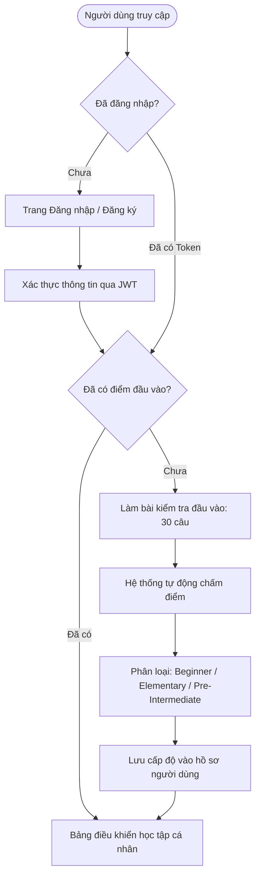
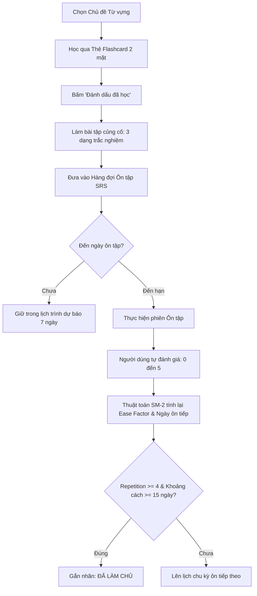
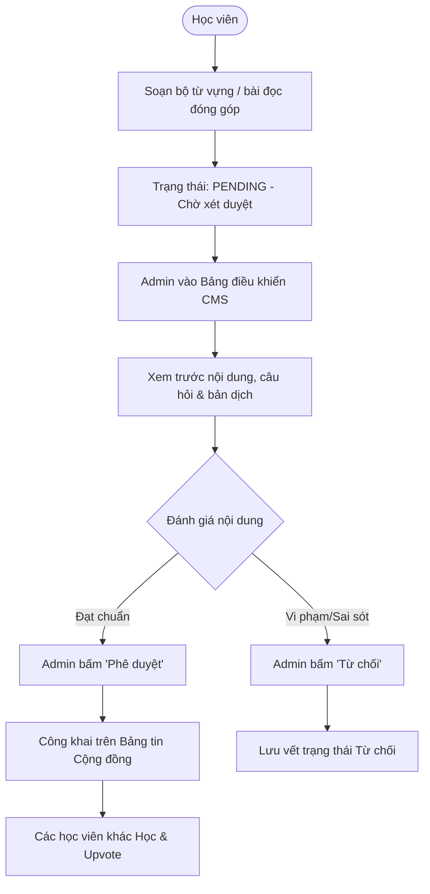

# 📚 TÀI LIỆU ĐẶC TẢ CHI TIẾT TẤT CẢ CHỨC NĂNG HỆ THỐNG ENGLEARN
> **Dự án:** EngLearn - Nền tảng học Tiếng Anh cơ bản thông minh  
> **Phiên bản:** 1.0.0 (Release Master)  
> **Đối tượng người dùng:** Học sinh, sinh viên, người mất gốc/mới bắt đầu học tiếng Anh, Trưởng nhóm học tập và Quản trị viên hệ thống.

---

## 📑 MỤC LỤC TỔNG QUAN

1. [TỔNG QUAN HỆ THỐNG & CÔNG NGHỆ](#1-tổng-quan-hệ-thống--công-nghệ)
2. [MA TRẬN PHÂN QUYỀN HỆ THỐNG (ROLE MATRIX)](#2-ma-trận-phân-quyền-hệ-thống-role-matrix)
3. [SƠ ĐỒ LUỒNG NGHIỆP VỤ TRỌNG TÂM (MERMAID WORKFLOWS)](#3-sơ-đồ-luồng-nghiệp-vụ-trọng-tâm-mermaid-workflows)
4. [CHI TIẾT 13 PHÂN HỆ CHỨC NĂNG](#4-chi-tiết-13-phân-hệ-chức-năng)
   - [Phân hệ 1: Xác thực & Quản lý Tài khoản (Authentication & Profile)](#phân-hệ-1-xác-thực--quản-lý-tài-khoản)
   - [Phân hệ 2: Đánh giá Trình độ Đầu vào (Placement Assessment Test)](#phân-hệ-2-đánh-giá-trình-độ-đầu-vào)
   - [Phân hệ 3: Khám phá & Quản lý Từ vựng theo Chủ đề (Vocabulary by Topics)](#phân-hệ-3-khám-phá--quản-lý-từ-vựng-theo-chủ-đề)
   - [Phân hệ 4: Học từ vựng tương tác qua Thẻ ghi nhớ (Flashcards)](#phân-hệ-4-học-từ-vựng-tương-tác-qua-thẻ-ghi-nhớ-flashcards)
   - [Phân hệ 5: Luyện tập & Đánh giá Củng cố Từ vựng (Exercise Generator)](#phân-hệ-5-luyện-tập--đánh-giá-củng-cố-từ-vựng)
   - [Phân hệ 6: Hệ thống Ôn tập Ngắt quãng Thông minh (Spaced Repetition SM-2)](#phân-hệ-6-hệ-thống-ôn-tập-ngắt-quãng-thông-minh-srs)
   - [Phân hệ 7: Luyện Kỹ năng Đọc hiểu & Trắc nghiệm Ngữ cảnh (Reading Comprehension)](#phân-hệ-7-luyện-kỹ-năng-đọc-hiểu--trắc-nghiệm-ngữ-cảnh)
   - [Phân hệ 8: Thuật toán Gợi ý Bài đọc Thông minh (Recommendation Engine)](#phân-hệ-8-thuật-toán-gợi-ý-bài-đọc-thông-minh)
   - [Phân hệ 9: Không gian Học tập Nhóm & Tương tác (Collaborative Groups)](#phân-hệ-9-không-gian-học-tập-nhóm--tương-tác)
   - [Phân hệ 10: Diễn đàn Chia sẻ & Đóng góp Nội dung (Community UGC)](#phân-hệ-10-diễn-đàn-chia-sẻ--đóng-góp-nội-dung)
   - [Phân hệ 11: Bảng Quản trị & CMS Nội dung (Admin Control Panel)](#phân-hệ-11-bảng-quản-trị--cms-nội-dung)
   - [Phân hệ 12: Báo cáo, Phân tích & Gamification (Analytics & Streak)](#phân-hệ-12-báo-cáo-phân-tích--gamification)
   - [Phân hệ 13: Tiện ích Trải nghiệm & Cơ chế Bảo mật Hệ thống (UX & Security)](#phân-hệ-13-tiện-ích-trải-nghiệm--cơ-chế-bảo-mật-hệ-thống)
5. [CƠ SỞ DỮ LIỆU & BẢNG ÁNH XẠ DỮ LIỆU (DATABASE SCHEMA MAPPING)](#5-cơ-sở-dữ-liệu--bảng-ánh-xạ-dữ-liệu)
6. [TỔNG KẾT & ĐÁNH GIÁ CHẤT LƯỢNG HỆ THỐNG](#6-tổng-kết--đánh-giá-chất-lượng-hệ-thống)

---

## 1. TỔNG QUAN HỆ THỐNG & CÔNG NGHỆ

### 1.1. Mục tiêu dự án
**EngLearn** là giải pháp phần mềm toàn diện hỗ trợ người học tiếng Anh cá nhân hóa lộ trình học, tập trung giải quyết triệt để 2 vấn đề lớn:
1. **Tình trạng học trước quên sau:** Được giải quyết bằng thuật toán lặp lại ngắt quãng **SuperMemo 2 (SM-2)** khoa học, tự động lên lịch nhắc nhở từ vựng vào đúng "điểm rơi trí nhớ".
2. **Thiếu tính định hướng và kết nối:** Cung cấp bài đánh giá năng lực đầu vào chuẩn hóa, tự động đề xuất bài đọc theo năng lực, đồng thời xây dựng môi trường học nhóm và diễn đàn đóng góp cộng đồng.

### 1.2. Kiến trúc & Công nghệ (Tech Stack)
- **Frontend Client:**
  - Ngôn ngữ & Thư viện: React 19, JavaScript (ESNext), Vite 6 (Fast Refresh & Bundling)
  - Quản lý trạng thái (State Management): **Zustand** (Store tập trung gọn nhẹ cho Auth, Vocab, Study Progress)
  - Định tuyến (Routing): **React Router DOM v7** (Browser router, Protected routes, Dynamic parameters)
  - Giao diện & Styling: **Tailwind CSS v4**, Heroicons, CSS transitions mượt mà
  - Hiển thị phản hồi: **React Hot Toast**, Modals tương tác, Progress Bars
  - Giao tiếp Backend: **Axios** (kèm Request/Response Interceptors tự động đính kèm Bearer Token và xử lý lỗi)
- **Backend API Server:**
  - Nền tảng: Node.js (>= 18), **Express.js 5** (RESTful API architecture)
  - ORM & Cơ sở dữ liệu: **Sequelize ORM** kết nối **MySQL 8.0**
  - Xác thực & Bảo mật: **JSON Web Token (JWT)**, cơ chế băm mật khẩu an toàn **bcryptjs**, phân tầng Middleware kiểm soát quyền
  - Cấu trúc kiến trúc: Mô hình **Controller - Service - Model - Route** phân tách độc lập (Separation of Concerns).

---

## 2. MA TRẬN PHÂN QUYỀN HỆ THỐNG (ROLE MATRIX)

Hệ thống định nghĩa rõ 4 vai trò tác nhân (Actors):
- **Khách vãng lai (Guest):** Người chưa xác thực.
- **Học viên (Learner / User):** Người dùng thông thường đã đăng nhập.
- **Trưởng nhóm học tập (Group Owner):** Học viên sở hữu hoặc quản lý nhóm học tập do mình tạo.
- **Quản trị viên (Admin):** Tài khoản quản trị cấp cao nhất, nắm quyền kiểm duyệt và điều hành toàn bộ dữ liệu.

| Nhóm chức năng | Khách (Guest) | Học viên (Learner) | Trưởng nhóm (Group Owner) | Quản trị viên (Admin) |
|---|:---:|:---:|:---:|:---:|
| Đăng ký, Đăng nhập, Xem giới thiệu | ✅ | ✅ | ✅ | ✅ |
| Làm bài kiểm tra năng lực đầu vào | ❌ | ✅ | ✅ | ✅ |
| Xem từ vựng theo chủ đề & Tra cứu | ❌ | ✅ | ✅ | ✅ |
| Học Flashcard, Làm bài tập trắc nghiệm | ❌ | ✅ | ✅ | ✅ |
| Ôn tập ngắt quãng thông minh (SM-2) | ❌ | ✅ | ✅ | ✅ |
| Luyện kỹ năng đọc hiểu & Làm quiz bài đọc | ❌ | ✅ | ✅ | ✅ |
| Nhận gợi ý bài đọc cá nhân hóa | ❌ | ✅ | ✅ | ✅ |
| Tạo nhóm học tập & Quản lý thành viên nhóm | ❌ | ❌ | ✅ | ✅ |
| Biên soạn bộ từ vựng & Gán bài đọc cho nhóm | ❌ | ❌ | ✅ | ✅ |
| Tham gia nhóm qua mã mời (Invite Code) | ❌ | ✅ | ✅ | ✅ |
| Gửi bài đóng góp cộng đồng (UGC) & Upvote | ❌ | ✅ | ✅ | ✅ |
| Quản lý người dùng (Khóa/Mở, Phân quyền) | ❌ | ❌ | ❌ | ✅ |
| Quản lý danh mục Chủ đề, Từ vựng, Bài đọc | ❌ | ❌ | ❌ | ✅ |
| Kiểm duyệt bài viết cộng đồng (Duyệt/Từ chối)| ❌ | ❌ | ❌ | ✅ |
| Xem bảng thống kê toàn hệ thống | ❌ | ❌ | ❌ | ✅ |

---

## 3. SƠ ĐỒ LUỒNG NGHIỆP VỤ TRỌNG TÂM (MERMAID WORKFLOWS)

### 3.1. Luồng Xác thực & Phân loại trình độ đầu vào

### 3.2. Luồng Học từ vựng, Luyện tập & Chu kỳ Ôn tập ngắt quãng (SM-2)

### 3.3. Luồng Quản trị & Kiểm duyệt nội dung cộng đồng

---

## 4. CHI TIẾT 13 PHÂN HỆ CHỨC NĂNG

---

### PHÂN HỆ 1: XÁC THỰC & QUẢN LÝ TÀI KHOẢN
**Mục đích:** Cung cấp cơ chế định danh an toàn, quản lý phiên làm việc và hồ sơ học tập của từng cá nhân.

#### 1. Chi tiết chức năng:
- **Đăng ký tài khoản (Register):**
  - Nhập: Họ và tên, Tên đăng nhập (`username`), Email, Mật khẩu (`password`).
  - Hệ thống kiểm tra: Email đúng định dạng regex, tên đăng nhập không chứa ký tự đặc biệt nguy hiểm, mật khẩu có độ dài tối thiểu từ 6 ký tự.
  - Ngăn chặn triệt để tình trạng trùng lặp email hoặc tên đăng nhập qua Unique Constraints trong CSDL.
- **Đăng nhập hệ thống (Login):**
  - Nhập Email và Mật khẩu. Kiểm tra tính trùng khớp qua thuật toán `bcrypt.compare`.
  - Kiểm tra trạng thái tài khoản (`is_active`): Chặn đăng nhập tức thì nếu tài khoản đã bị Quản trị viên vô hiệu hóa.
  - Cấp phát Access Token (lưu trữ phiên) và lưu thông tin người dùng vào Local Storage / Zustand Auth Store.
- **Điều hướng thông minh sau đăng nhập:**
  - Nếu tài khoản học viên mới chưa có điểm đánh giá đầu vào (`initial_level == null`), hệ thống tự động cưỡng chế chuyển hướng đến trang `/assessment`.
  - Nếu đã hoàn thành, điều hướng thẳng tới `/dashboard`.
- **Đăng xuất an toàn (Logout):**
  - Xóa sạch mã phiên làm việc khỏi bộ nhớ client, xóa trạng thái đăng nhập trong ứng dụng, chuyển hướng người dùng về màn hình đăng nhập.
- **Hồ sơ cá nhân & Cài đặt mục tiêu (User Profile):**
  - Xem thông tin cá nhân: Avatar, Họ tên, Username, Email, Vai trò (`role`), Cấp độ học viên, Ngày tham gia hệ thống.
  - Đổi thông tin: Cập nhật họ tên hiển thị.
  - Đổi mật khẩu an toàn: Yêu cầu nhập mật khẩu hiện tại, mật khẩu mới và xác nhận mật khẩu mới.
  - Thiết lập mục tiêu ngày (**Daily Goal**): Điều chỉnh số lượng từ vựng cần học mục tiêu mỗi ngày (mặc định: 10 từ/ngày, có thể tùy chỉnh từ 5 đến 50 từ).
  - Chuỗi học liên tục (**Streak Counter**): Tự động tính số ngày đăng nhập và học tập liên tục không gián đoạn.

#### 2. Ánh xạ API & Dữ liệu:
- `POST /api/auth/register`: Đăng ký tài khoản mới.
- `POST /api/auth/login`: Đăng nhập & cấp phát JWT.
- `GET /api/auth/me`: Lấy thông tin tài khoản hiện tại từ token.
- `PUT /api/users/profile`: Cập nhật họ tên, mục tiêu hàng ngày (`daily_goal`).
- `PUT /api/users/change-password`: Thay đổi mật khẩu tài khoản.
- *Model dữ liệu liên quan:* `User`.
- *Giao diện tương ứng:* `LoginPage.jsx`, `RegisterPage.jsx`, `ProfilePage.jsx`.

---

### PHÂN HỆ 2: ĐÁNH GIÁ TRÌNH ĐỘ ĐẦU VÀO
**Mục đích:** Khảo sát trình độ Anh ngữ ban đầu của học viên để hệ thống phân nhóm trình độ và cá nhân hóa tài liệu gợi ý ngay từ đầu.

#### 1. Chi tiết chức năng:
- **Ngân hàng đề thi chuẩn hóa:**
  - Bộ đề thi gồm 30 câu hỏi trắc nghiệm ngữ pháp, từ vựng và cấu trúc câu từ cơ bản đến nâng cao.
  - **Bảo mật đề thi:** API chỉ gửi về nội dung câu hỏi và danh sách đáp án A, B, C, D; tuyệt đối **không gửi đáp án đúng và lời giải thích** xuống client trong quá trình làm bài nhằm chống gian lận (Inspect/F12).
- **Trải nghiệm làm bài trực quan:**
  - Thanh tiến trình hiển thị tỷ lệ hoàn thành (VD: Câu 12 / 30).
  - Cho phép người dùng chuyển câu, thay đổi lựa chọn đáp án bất kỳ lúc nào trước khi ấn nộp bài.
  - Cảnh báo người dùng nếu nhấn "Nộp bài" khi vẫn còn câu hỏi chưa được chọn đáp án.
- **Thuật toán Chấm điểm & Phân cấp Trình độ tự động:**
  - Điểm số được tính bằng số câu trả lời chính xác trên tổng số 30 câu.
  - **Quy tắc phân loại:**
    - **Pre-Intermediate (Trung cấp cơ bản):** Đạt từ 22 đến 30 câu đúng ($\ge 73.3\%$).
    - **Elementary (Sơ cấp):** Đạt từ 12 đến 21 câu đúng ($40\% - 70\%$).
    - **Beginner (Người mới bắt đầu):** Dưới 12 câu đúng ($< 40\%$).
- **Phân tích kết quả chi tiết:**
  - Trả về bảng tổng kết điểm số, tỷ lệ phần trăm và danh hiệu cấp độ đạt được.
  - Hiển thị danh sách toàn bộ 30 câu hỏi kèm: Đáp án học viên đã chọn, Đáp án chuẩn xác, và **Lời giải thích ngữ pháp chi tiết bằng tiếng Việt**.
  - Lưu kết quả vào bảng `LevelAssessment` và cập nhật trường `initial_level` của người dùng.

#### 2. Ánh xạ API & Dữ liệu:
- `GET /api/assessment/questions`: Lấy đề thi kiểm tra đầu vào (đã loại bỏ đáp án đúng).
- `POST /api/assessment/submit`: Nộp bài làm, hệ thống chấm điểm và lưu kết quả.
- `GET /api/assessment/history`: Xem lại lịch sử các lần làm bài kiểm tra.
- *Model dữ liệu liên quan:* `LevelAssessment`, `User`.
- *Giao diện tương ứng:* `AssessmentPage.jsx`.

---

### PHÂN HỆ 3: KHÁM PHÁ & QUẢN LÝ TỪ VỰNG THEO CHỦ ĐỀ
**Mục đích:** Cung cấp kho từ vựng tiếng Anh thông dụng theo các chủ đề thiết thực, có cấu trúc sư phạm rõ ràng.

#### 1. Chi tiết chức năng:
- **7 Chủ đề học tập cốt lõi:**
  1. *Daily Life* (Đời sống hàng ngày)
  2. *Education & Study* (Giáo dục & Học đường)
  3. *Travel & Holidays* (Du lịch & Nghỉ dưỡng)
  4. *Work & Business* (Công việc & Thương mại)
  5. *Food & Dining* (Ẩm thực & Nhà hàng)
  6. *Technology & Media* (Công nghệ & Truyền thông)
  7. *Health & Sports* (Sức khỏe & Thể thao)
- **Thông tin chi tiết của mỗi từ vựng:**
  - Từ gốc tiếng Anh, phiên âm quốc tế chuẩn IPA (ví dụ: `/ˈwɜːrk/`).
  - Phân loại từ loại ngữ pháp (Noun, Verb, Adjective, Adverb...).
  - Bản dịch nghĩa tiếng Việt chính xác và ngắn gọn.
  - Phân cấp độ khó: *Easy*, *Medium*, *Hard*.
  - Câu ví dụ ngữ cảnh chuẩn bản ngữ kèm bản dịch tiếng Việt song song.
- **Bộ lọc & Tra cứu nhanh:**
  - Tìm kiếm thời gian thực theo từ tiếng Anh hoặc nghĩa tiếng Việt.
  - Lọc từ vựng theo độ khó.
  - Thanh hiển thị tỷ lệ tiến độ hoàn thành từ vựng trong từng chủ đề (đã học bao nhiêu từ / tổng số từ).

#### 2. Ánh xạ API & Dữ liệu:
- `GET /api/topics`: Lấy danh sách toàn bộ chủ đề học tập kèm thống kê số lượng từ.
- `GET /api/topics/:id`: Lấy chi tiết thông tin chủ đề và danh sách từ vựng bên trong.
- `GET /api/vocabularies`: Tìm kiếm và lọc từ vựng theo chủ đề, độ khó.
- `GET /api/vocabularies/:id`: Xem chi tiết 1 từ vựng và các câu ví dụ minh họa.
- *Model dữ liệu liên quan:* `Topic`, `Vocabulary`, `VocabExample`, `UserVocabProgress`.
- *Giao diện tương ứng:* `TopicsPage.jsx`, `TopicDetailPage.jsx`.

---

### PHÂN HỆ 4: HỌC TỪ VỰNG TƯƠNG TÁC QUA THẺ GHI NHỚ (FLASHCARDS)
**Mục đích:** Tối ưu hóa khả năng ghi nhớ thị giác thông qua mô hình thẻ học 2 mặt tương tác trực quan.

#### 1. Chi tiết chức năng:
- **Giao diện thẻ 3D lật 2 mặt:**
  - **Mặt trước:** Từ vựng tiếng Anh kích thước lớn, phiên âm quốc tế IPA, nhãn loại từ và nút nghe phát âm.
  - **Mặt sau:** Định nghĩa tiếng Việt, câu ví dụ tiếng Anh chứa từ vựng được in đậm, bản dịch câu ví dụ tiếng Việt.
- **Tương tác linh hoạt:**
  - Nhấp chuột hoặc chạm màn hình để lật thẻ mượt mà.
  - Hỗ trợ phím tắt bàn phím máy tính: Phím `Space` để lật thẻ, Phím mũi tên $\leftarrow / \rightarrow$ để chuyển thẻ Trước/Tiếp theo.
  - Thanh tiến trình hiển thị chỉ số thẻ hiện tại (VD: Thẻ 7/25).
- **Đánh dấu học từ (Mark as Learned):**
  - Người dùng bấm "Đánh dấu đã học": Hệ thống tự động tạo bản ghi `UserVocabProgress` với trạng thái ban đầu là `new`/`learning`.
  - Tự động tạo bản ghi lịch ôn tập `ReviewSchedule` để đưa từ này vào hàng đợi thuật toán ngắt quãng SM-2.
  - Cập nhật số từ đã học trong ngày vào bộ đếm Daily Goal.

#### 2. Ánh xạ API & Dữ liệu:
- `POST /api/vocabularies/:id/learn`: Đánh dấu đã học một từ vựng và khởi tạo chu trình SRS.
- *Model dữ liệu liên quan:* `Vocabulary`, `VocabExample`, `UserVocabProgress`, `ReviewSchedule`.
- *Giao diện tương ứng:* `FlashcardPage.jsx`.

---

### PHÂN HỆ 5: LUYỆN TẬP & ĐÁNH GIÁ CỦNG CỐ TỪ VỰNG
**Mục đích:** Tự động sinh bài tập trắc nghiệm đa dạng giúp củng cố kiến thức ngay sau phiên học Flashcard.

#### 1. Chi tiết chức năng:
- **Bộ sinh bài tập tự động (Auto Quiz Generator):**
  - Tự động lấy danh sách từ vựng thuộc chủ đề đang học để tạo bài trắc nghiệm 10 câu hỏi.
  - Tự động trích xuất các đáp án gây nhiễu (distractors) từ các từ vựng khác trong cùng chủ đề để đảm bảo tính thử thách.
- **3 Dạng câu hỏi trắc nghiệm kết hợp:**
  1. **Dạng 1 - Trắc nghiệm Nghĩa Anh $\rightarrow$ Việt:** Đọc từ tiếng Anh và chọn đúng nghĩa tiếng Việt trong 4 đáp án.
  2. **Dạng 2 - Trắc nghiệm Nghĩa Việt $\rightarrow$ Anh:** Đọc nghĩa tiếng Việt và chọn đúng từ tiếng Anh tương ứng.
  3. **Dạng 3 - Điền từ vào ngữ cảnh câu (Fill in the Blank):** Đưa ra câu ví dụ bị ẩn từ khóa (`_____`), yêu cầu người học suy luận ngữ cảnh để chọn từ chính xác hoàn thành câu.
- **Cơ chế Phản hồi & Đánh giá tức thì:**
  - Đưa ra phản hồi màu sắc (Xanh lá cho đáp án đúng, Đỏ cho đáp án sai).
  - Hiển thị giải thích chi tiết câu đúng ngay khi chọn.
  - Bảng tổng kết kết quả: Điểm số, tỷ lệ phần trăm chính xác.
  - Tự động đồng bộ số lần trả lời đúng (`correct_count`) hoặc sai (`incorrect_count`) vào bảng dữ liệu tiến độ cá nhân.

#### 2. Ánh xạ API & Dữ liệu:
- `GET /api/exercises/topic/:topicId`: Sinh bộ câu hỏi trắc nghiệm ngẫu nhiên cho chủ đề.
- `POST /api/exercises/submit`: Gửi kết quả bài tập, hệ thống chấm điểm và ghi nhận tiến độ.
- *Model dữ liệu liên quan:* `Vocabulary`, `VocabExample`, `UserVocabProgress`.
- *Giao diện tương ứng:* `ExercisePage.jsx`.

---

### PHÂN HỆ 6: HỆ THỐNG ÔN TẬP NGẮT QUÃNG THÔNG MINH (SRS)
**Mục đích:** Ứng dụng thuật toán **SuperMemo 2 (SM-2)** để tự động tính toán thời gian sắp quên của từng từ và nhắc học viên ôn tập đúng thời điểm vàng.

#### 1. Chi tiết thuật toán SM-2 triển khai trong hệ thống:
- Khi ôn tập, người học tự đánh giá mức độ ghi nhớ theo thang điểm chất lượng **$q$ từ 0 đến 5**:
  - **$q = 0$:** Hoàn toàn không nhớ gì (Blackout).
  - **$q = 1$:** Trả lời sai, nhưng khi nhìn đáp án thì nhớ ra.
  - **$q = 2$:** Trả lời sai, nhưng cảm thấy từ rất quen thuộc.
  - **$q = 3$:** Nhớ đúng, nhưng mất nhiều thời gian suy nghĩ (Khó).
  - **$q = 4$:** Nhớ đúng, sau một chút do dự (Tốt).
  - **$q = 5$:** Nhớ đúng hoàn hảo, phản xạ tức thì (Rất dễ).

- **Công thức điều chỉnh Hệ số Dễ (Ease Factor - $EF$):**
  $$EF' = EF + (0.1 - (5 - q) \times (0.08 + (5 - q) \times 0.02))$$
  - Điều kiện ràng buộc: Nếu $EF' < 1.3$, hệ thống tự động gán $EF' = 1.3$ (tránh việc từ bị giảm độ dãn cách quá thấp). Giá trị khởi tạo mặc định là $EF = 2.5$.

- **Quy tắc tính khoảng cách ngày ôn tập tiếp theo ($I$ - Interval Days):**
  - Nếu chất lượng $q < 3$ (Học viên nhớ sai hoặc quên):
    - Đặt lại chuỗi lặp: $\text{repetition\_count} = 0$.
    - Khoảng cách ngày: $I = 1$ ngày (Ôn lại ngay ngày mai).
  - Nếu chất lượng $q \ge 3$ (Học viên nhớ đúng):
    - Lần lặp đầu tiên ($\text{repetition} = 0$): $I = 1$ ngày.
    - Lần lặp thứ hai ($\text{repetition} = 1$): $I = 6$ ngày.
    - Từ lần lặp thứ ba trở đi ($\text{repetition} \ge 2$): $I = \text{round}(I_{\text{trước}} \times EF)$.
    - Tăng chuỗi lặp: $\text{repetition\_count} = \text{repetition\_count} + 1$.

- **Quy chuẩn công nhận Từ đã làm chủ (Mastered):**
  - Một từ vựng được tự động chuyển từ trạng thái `learning` sang `mastered` khi thỏa mãn đồng thời:
    1. Chuỗi nhớ đúng liên tiếp $\text{repetition\_count} \ge 4$.
    2. Khoảng cách ngày ôn tập giãn cách $I \ge 15$ ngày.

#### 2. Các chức năng trên giao diện SRS:
- **Danh sách từ đến hạn hôm nay (Due Today):** Tự động truy vấn tất cả các từ có `next_review_at <= thời điểm hiện tại`.
- **Dự báo lịch ôn tập 7 ngày tới (7-Day Forecast):** Biểu đồ cột hiển thị số lượng từ sẽ đến hạn trong 7 ngày tiếp theo để học viên chủ động kế hoạch học.
- **Phiên ôn tập tương tác (SRS Flashcard Session):** Lần lượt hiển thị từ cần ôn, cho phép lật xem nghĩa và chọn 1 trong 4 nút đánh giá tương ứng (Quên, Khó, Nhớ tốt, Rất dễ).

#### 3. Ánh xạ API & Dữ liệu:
- `GET /api/reviews/today`: Lấy danh sách từ vựng cần ôn tập trong ngày hôm nay.
- `GET /api/reviews/forecast`: Lấy dữ liệu dự báo lịch ôn tập 7 ngày tới.
- `POST /api/reviews/answer`: Gửi đánh giá độ nhớ ($q$), hệ thống tính toán lại SM-2 và dời lịch ôn tiếp theo.
- `GET /api/reviews/stats`: Lấy thống kê số lượng từ theo trạng thái: Mới (`new`), Đang học (`learning`), Đã thuộc (`mastered`).
- *Model dữ liệu liên quan:* `UserVocabProgress`, `ReviewSchedule`, `Vocabulary`.
- *Giao diện tương ứng:* `ReviewPage.jsx`.

---

### PHÂN HỆ 7: LUYỆN KỸ NĂNG ĐỌC HIỂU & TRẮC NGHIỆM NGỮ CẢNH
**Mục đích:** Giúp người học áp dụng từ vựng vào việc đọc hiểu các đoạn văn ngắn, rèn luyện tư duy ngữ pháp và ngữ cảnh bài viết.

#### 1. Chi tiết chức năng:
- **Thư viện bài đọc phân cấp:**
  - Bài đọc gắn liền với chủ đề thực tế, được phân loại theo 3 độ khó: *Easy*, *Medium*, *Hard*.
  - Hiển thị ước tính thời gian đọc (Reading Time tính bằng phút) và tổng số từ trong bài.
- **Giao diện đọc bài song ngữ thông minh:**
  - Bài viết tiếng Anh hiển thị chuẩn font chữ, cỡ chữ tối ưu cho việc đọc không mỏi mắt.
  - **Bản dịch tiếng Việt song song:** Tính năng bật/tắt hiển thị bản dịch tiếng Việt ngay cạnh bài gốc để học viên đối chiếu khi gặp câu khó.
- **Bài trắc nghiệm đọc hiểu đính kèm:**
  - Mỗi bài đọc có từ 3 đến 5 câu hỏi trắc nghiệm kiểm tra chi tiết thông tin, ý chính và suy luận ngữ cảnh.
  - Đồng hồ đếm thời gian làm bài thực tế của học viên.
- **Chấm điểm & Lưu trữ nỗ lực:**
  - Chấm điểm ngay khi học viên nộp bài.
  - Phân tích chi tiết câu đúng/sai kèm giải thích vì sao đáp án đó chính xác.
  - Ghi nhận lượt làm bài vào `UserReadingAttempt` và chi tiết từng đáp án vào `UserAnswer`.
  - Cập nhật huy hiệu "Đã hoàn thành" và ghi nhận điểm số cao nhất của người học.

#### 2. Ánh xạ API & Dữ liệu:
- `GET /api/readings`: Lấy danh sách bài đọc kèm bộ lọc theo chủ đề và độ khó.
- `GET /api/readings/:id`: Lấy nội dung chi tiết bài đọc và bộ câu hỏi trắc nghiệm đi kèm.
- `POST /api/readings/:id/submit`: Nộp bài kiểm tra đọc hiểu, chấm điểm và lưu kết quả.
- *Model dữ liệu liên quan:* `Reading`, `Question`, `UserReadingAttempt`, `UserAnswer`.
- *Giao diện tương ứng:* `ReadingListPage.jsx`, `ReadingDetailPage.jsx`.

---

### PHÂN HỆ 8: THUẬT TOÁN GỢI Ý BÀI ĐỌC THÔNG MINH
**Mục đích:** Tự động đề xuất các bài đọc phù hợp nhất với năng lực và quá trình học tập thực tế của học viên.

#### 1. Chi tiết thuật toán Gợi ý (Recommendation Logic):
- **Gợi ý theo Trình độ năng lực (Initial Level Matching):**
  - Căn cứ vào điểm bài đánh giá đầu vào (`initial_level`):
    - Điểm $\ge 75$: Ưu tiên gợi ý các bài đọc mức độ **Hard**.
    - Điểm từ $50 - 74$: Ưu tiên gợi ý các bài đọc mức độ **Medium**.
    - Điểm $< 50$: Ưu tiên gợi ý các bài đọc mức độ **Easy**.
- **Lọc bỏ bài đọc đã hoàn thành:** Hệ thống tự động loại trừ các bài đọc mà người dùng đã từng làm bài kiểm tra trong quá khứ (`UserReadingAttempt`), đảm bảo mỗi bài gợi ý đều mang lại kiến thức mới.
- **Dự phòng (Fallback):** Trong trường hợp bài đọc đúng trình độ đã được làm hết, hệ thống sẽ linh hoạt bổ sung các bài đọc chưa làm ở cấp độ lân cận.
- **Phân tích khoảng trống kiến thức (Learning Gap Analysis):**
  - Thống kê tỷ lệ phần trăm từ vựng đã học trên từng chủ đề.
  - Sắp xếp tăng dần để phát hiện các chủ đề học viên đang bỏ bê hoặc yếu nhất, từ đó gợi ý bài đọc và từ vựng thuộc các chủ đề này để bù đắp kiến thức.

#### 2. Ánh xạ API & Dữ liệu:
- `GET /api/readings/recommended`: Lấy danh sách 5 bài đọc được cá nhân hóa riêng cho học viên.
- `GET /api/stats/gaps`: Lấy kết quả phân tích các chủ đề cần củng cố kiến thức.
- *Service xử lý:* `RecommendationService.js`.
- *Giao diện tương ứng:* `DashboardPage.jsx`, `ReadingListPage.jsx`.

---

### PHÂN HỆ 9: KHÔNG GIAN HỌC TẬP NHÓM & TƯƠNG TÁC
**Mục đích:** Xây dựng môi trường học tập cộng tác, cho phép các nhóm bạn bè hoặc lớp học chia sẻ tài liệu học chung.

#### 1. Chi tiết chức năng:
- **Tạo nhóm học tập (Create Group):**
  - Bất kỳ học viên nào cũng có thể tạo nhóm bằng cách đặt Tên nhóm và Mô tả mục tiêu học.
  - Hệ thống tự động phát sinh một **Mã mời độc nhất gồm 8 ký tự ngẫu nhiên** (Invite Code, ví dụ: `A8K9F2D1`).
  - Người tạo nhóm mặc nhiên trở thành **Trưởng nhóm (Owner)**.
- **Tham gia nhóm qua Mã mời (Join via Code):**
  - Học viên chỉ cần nhập mã mời 8 ký tự để gia nhập nhóm ngay lập tức.
  - Ngăn chặn việc tham gia trùng lặp hoặc tự tham gia nhóm do mình làm chủ.
- **Quyền hạn Trưởng nhóm (Group Owner):**
  - Chỉnh sửa thông tin nhóm (Tên, Mô tả).
  - Tái tạo mã mời mới (Reset Invite Code) khi cần nâng cao tính bảo mật.
  - Xem danh sách thành viên và xóa thành viên khỏi nhóm.
  - **Tạo bộ từ vựng riêng của nhóm (Group Vocab Set):** Biên soạn danh sách các từ vựng đặc thù cho các thành viên trong nhóm cùng học.
  - **Gán bài đọc cho nhóm (Assign Reading):** Chọn các bài đọc trong hệ thống để giao bài tập chung cho cả nhóm.
- **Trải nghiệm của Thành viên nhóm (Group Member):**
  - Xem thông tin nhóm, danh sách các thành viên cùng tham gia.
  - Học các bộ từ vựng do Trưởng nhóm biên soạn. Khi học từ nhóm, tiến độ vẫn được đồng bộ vào hệ thống SRS cá nhân.
  - Làm các bài đọc được giao cho nhóm.
  - Xem Bảng xếp hạng thi đua nội bộ nhóm dựa trên điểm số và số lượng từ đã học.

#### 2. Ánh xạ API & Dữ liệu:
- `POST /api/groups`: Tạo nhóm học tập mới.
- `GET /api/groups`: Lấy danh sách các nhóm người dùng đang tham gia.
- `GET /api/groups/:id`: Xem chi tiết thông tin nhóm, thành viên và tài liệu.
- `POST /api/groups/join`: Tham gia nhóm bằng mã mời.
- `POST /api/groups/:id/vocab-sets`: Trưởng nhóm tạo bộ từ vựng nhóm.
- `POST /api/groups/:id/readings`: Trưởng nhóm gán bài đọc cho nhóm.
- `DELETE /api/groups/:id/members/:userId`: Trưởng nhóm xóa thành viên.
- *Model dữ liệu liên quan:* `Group`, `GroupMember`, `GroupVocabSet`, `GroupVocabItem`, `GroupReadingSet`.
- *Giao diện tương ứng:* `GroupsPage.jsx`, `GroupDetailPage.jsx`.

---

### PHÂN HỆ 10: DIỄN ĐÀN CHIA SẺ & ĐÓNG GÓP NỘI DUNG
**Mục đích:** Huy động sức mạnh cộng đồng học viên để cùng xây dựng kho tài liệu tiếng Anh phong phú, đa dạng.

#### 1. Chi tiết chức năng:
- **Đóng góp tài liệu học tập:**
  - Học viên có thể tự soạn thảo và gửi lên 2 loại nội dung:
    1. **Bộ từ vựng đóng góp:** Nhập tiêu đề, mô tả, danh sách các từ vựng kèm phiên âm, nghĩa tiếng Việt và câu ví dụ.
    2. **Bài đọc đóng góp:** Nhập tiêu đề, nội dung bài văn tiếng Anh, bản dịch tiếng Việt, độ khó và danh sách câu hỏi trắc nghiệm đi kèm.
- **Hàng đợi kiểm duyệt an toàn (Moderation Queue):**
  - Tất cả bài đăng do người dùng gửi lên mặc định mang trạng thái `status: 'pending'`.
  - Nội dung này hoàn toàn **chưa xuất hiện công khai** trên diễn đàn cộng đồng cho đến khi được Quản trị viên duyệt.
- **Khám phá tài liệu cộng đồng:**
  - Học viên duyệt danh sách các tài liệu đã được duyệt (`status: 'approved'`).
  - Lọc theo loại nội dung (Bộ từ vựng hoặc Bài đọc).
  - Trải nghiệm học và làm bài tập trực tiếp từ các bài đóng góp này.
- **Bình chọn yêu thích (Upvote System):**
  - Học viên có thể nhấn "Upvote" cho những bài viết chất lượng.
  - Hệ thống tự động xếp hạng các tài liệu có số lượt Upvote cao nhất lên đầu bảng tin cộng đồng.
- **Quản lý bài đóng góp cá nhân:**
  - Trang cá nhân hiển thị danh sách các bài người dùng đã gửi kèm trạng thái rõ ràng: *Chờ duyệt (Pending)*, *Đã duyệt (Approved)*, hoặc *Bị từ chối (Rejected)*.

#### 2. Ánh xạ API & Dữ liệu:
- `GET /api/community`: Lấy danh sách các bài viết cộng đồng đã được duyệt.
- `POST /api/community`: Gửi bài đóng góp mới (từ vựng hoặc bài đọc).
- `POST /api/community/:id/upvote`: Tăng lượt bình chọn cho bài viết.
- `GET /api/community/my-posts`: Xem danh sách các bài viết do chính mình đóng góp.
- *Model dữ liệu liên quan:* `CommunityPost`, `User`.
- *Giao diện tương ứng:* `CommunityPage.jsx`, `CommunitySubmitPage.jsx`.

---

### PHÂN HỆ 11: BẢNG QUẢN TRỊ & CMS NỘI DUNG
**Mục đích:** Khu vực kiểm soát dữ liệu trung tâm dành riêng cho tài khoản Quản trị viên (Role: `admin`).

#### 1. Chi tiết chức năng:
- **Bảo mật truy cập cấp Router & API:**
  - Phía Client: Route `/admin` được bọc bởi `ProtectedRoute allowedRoles={['admin']}`. Nếu học viên thông thường cố tình truy cập sẽ tự động bị chuyển hướng về `/dashboard`.
  - Phía Server: Middleware `isAdmin` chặn đứng mọi request không có quyền admin với mã lỗi `403 Forbidden`.
- **Quản lý người dùng (User Management):**
  - Hiển thị danh sách toàn bộ tài khoản người dùng trong hệ thống kèm Avatar, Tên, Email, Quyền hạn, Trình độ và Trạng thái hoạt động.
  - Tìm kiếm người dùng theo tên hoặc email.
  - Thao tác: Khóa tài khoản (`is_active = false`) để cấm đăng nhập, hoặc Mở khóa tài khoản.
  - Thao tác: Nâng cấp vai trò người dùng thành Admin hoặc hạ cấp về Learner.
- **Quản lý danh mục Chủ đề & Từ vựng (Vocabulary CMS):**
  - Thêm chủ đề mới, chỉnh sửa thông tin mô tả, xóa chủ đề.
  - Thêm từ vựng mới: Nhập từ, phiên âm, từ loại, nghĩa tiếng Việt, cấp độ khó, và thêm các câu ví dụ mẫu.
  - Chỉnh sửa và xóa từ vựng khỏi hệ thống.
- **Quản lý Bài đọc hiểu (Reading CMS):**
  - Đăng tải bài đọc mới kèm bản dịch song ngữ tiếng Việt.
  - Tạo bộ câu hỏi trắc nghiệm tương ứng cho bài đọc, chỉ định đáp án đúng và lời giải thích.
  - Chỉnh sửa hoặc xóa các bài đọc hiện có.
- **Kiểm duyệt bài viết cộng đồng (Community Moderation):**
  - Xem danh sách các bài đóng góp đang ở trạng thái `pending`.
  - Xem chi tiết toàn bộ nội dung bài đóng góp.
  - Thao tác: **Phê duyệt (Approve)** - Đưa bài viết lên bảng tin cộng đồng.
  - Thao tác: **Từ chối (Reject)** - Loại bỏ bài viết không đạt tiêu chuẩn văn hóa hoặc học thuật.
- **Thống kê tổng quan hệ thống:**
  - Hiển thị các thẻ chỉ số: Tổng số học viên, Tổng số chủ đề, Tổng số từ vựng, Tổng số bài đọc và Số lượng bài viết đang chờ duyệt.

#### 2. Ánh xạ API & Dữ liệu:
- `GET /api/admin/users`: Lấy danh sách người dùng.
- `PATCH /api/admin/users/:id/status`: Khóa hoặc kích hoạt lại người dùng.
- `PATCH /api/admin/users/:id/role`: Đổi quyền hạn người dùng (learner $\leftrightarrow$ admin).
- `POST /api/admin/topics`: Tạo chủ đề học tập mới.
- `PUT /api/admin/topics/:id`, `DELETE /api/admin/topics/:id`: Sửa/xóa chủ đề.
- `POST /api/admin/vocabularies`: Thêm từ vựng mới vào kho dữ liệu.
- `PUT /api/admin/vocabularies/:id`, `DELETE /api/admin/vocabularies/:id`: Sửa/xóa từ vựng.
- `POST /api/admin/readings`: Tạo bài đọc và câu hỏi trắc nghiệm mới.
- `PUT /api/admin/readings/:id`, `DELETE /api/admin/readings/:id`: Sửa/xóa bài đọc.
- `GET /api/admin/community/pending`: Lấy danh sách bài đóng góp chờ duyệt.
- `PATCH /api/admin/community/:id/approve`: Duyệt bài đóng góp.
- `PATCH /api/admin/community/:id/reject`: Từ chối bài đóng góp.
- `GET /api/admin/stats`: Lấy các chỉ số thống kê hệ thống tổng thể.
- *Giao diện tương ứng:* `AdminPage.jsx`.

---

### PHÂN HỆ 12: BÁO CÁO, PHÂN TÍCH & GAMIFICATION
**Mục đích:** Trực quan hóa tiến độ học tập, tạo động lực duy trì việc học hàng ngày thông qua cơ chế trò chơi hóa (Gamification).

#### 1. Chi tiết chức năng:
- **Bảng điều khiển cá nhân (Learning Dashboard):**
  - **Thẻ chỉ số tổng quan:**
    - Tổng số từ vựng đã học (`Total Learned Words`).
    - Số từ đã ghi nhớ thành thạo (`Mastered Words`).
    - Tổng số bài đọc hiểu đã hoàn thành.
    - Điểm đọc hiểu trung bình.
- **Đồng hồ mục tiêu hàng ngày (Daily Goal Progress):**
  - Hiển thị số từ đã học trong ngày hôm nay so với mục tiêu đặt ra (Ví dụ: `8 / 10 từ - Đạt 80%`).
  - Thanh tiến trình đổi màu sinh động khi học viên chạm mốc 100% mục tiêu ngày.
- **Bộ đếm chuỗi ngày học liên tục (Streak Counter):**
  - Biểu tượng ngọn lửa may mắn kèm số ngày liên tiếp học viên đăng nhập và hoàn thành bài học.
  - Tự động reset chuỗi về 1 nếu học viên bỏ bẵng quá 1 ngày không học.
- **Biểu đồ trực quan hóa dữ liệu học tập:**
  - **Biểu đồ phân bổ trạng thái từ vựng:** Hiển thị trực quan tỷ lệ giữa Từ mới (`new`) - Đang học (`learning`) - Đã làm chủ (`mastered`).
  - **Biểu đồ xu hướng học tập trong tuần:** Thể hiện số lượng bài học và từ vựng tích lũy qua từng ngày trong 7 ngày gần nhất.

#### 2. Ánh xạ API & Dữ liệu:
- `GET /api/stats/dashboard`: Lấy tất cả dữ liệu thống kê tổng hợp cho Dashboard người dùng.
- `GET /api/stats/streak`: Lấy thông tin chuỗi ngày học liên tục hiện tại.
- *Service xử lý:* `stats.controller.js`.
- *Giao diện tương ứng:* `DashboardPage.jsx`.

---

### PHÂN HỆ 13: TIỆN ÍCH TRẢI NGHIỆM & CƠ CHẾ BẢO MẬT HỆ THỐNG
**Mục đích:** Nâng cao trải nghiệm người dùng cuối (UX), đảm bảo an toàn dữ liệu và tính ổn định của hệ thống.

#### 1. Chi tiết chức năng:
- **Thiết kế thích ứng đa thiết bị (Responsive Web Design):**
  - Giao diện được tối ưu hóa hiển thị mượt mà trên Desktop, Laptop, Máy tính bảng (Tablet) và Điện thoại thông minh (Mobile) thông qua hệ thống Grid và Flexbox của Tailwind CSS.
  - Thanh điều hướng (Navbar / Sidebar) co giãn linh hoạt, menu hamburger trực quan trên màn hình nhỏ.
- **Hệ thống thông báo tức thời (Toast Feedback):**
  - Tích hợp `react-hot-toast` với giao diện thông báo sang trọng, hiển thị tức thì khi người dùng hoàn thành một hành vi (đăng nhập thành công, lưu từ, nộp bài, hoặc báo lỗi khi nhập sai dữ liệu).
- **Cơ chế chống gửi lặp (Anti Double-Submission):**
  - Tự động vô hiệu hóa (`disabled`) nút bấm và hiển thị spinner trạng thái loading khi đang gửi request lên server, ngăn ngừa việc người dùng click nhiều lần gây trùng lặp dữ liệu trong CSDL.
- **Xử lý trang không tồn tại (Custom 404 Not Found Page):**
  - Giao diện thông báo trang 404 thân thiện, có nút bấm điều hướng nhanh quay lại Trang chủ hoặc Dashboard.
- **Kiến trúc Bảo mật tầng sâu (Security Architecture):**
  - **Bảo mật mật khẩu:** Mã hóa 1 chiều bằng thuật toán `bcryptjs` với salt rounds an toàn trước khi lưu vào CSDL.
  - **Bảo mật truy vấn:** 100% truy vấn cơ sở dữ liệu thông qua Sequelize ORM, sử dụng Parameterized Queries giúp ngăn chặn tuyệt đối lỗi SQL Injection.
  - **Cơ chế JWT:** Xác thực không trạng thái (Stateless Authentication), kiểm tra thời hạn token trong từng request qua Middleware `authenticate`.
  - **Xử lý lỗi tập trung:** Lớp `AppError` và middleware `errorHandler` bắt mọi ngoại lệ, chỉ trả về thông báo lỗi an toàn cho client, không làm lộ stack trace hoặc cấu trúc cơ sở dữ liệu.

---

## 5. CƠ SỞ DỮ LIỆU & BẢNG ÁNH XẠ DỮ LIỆU (DATABASE SCHEMA MAPPING)

Hệ thống được thiết kế với **16 Thực thể dữ liệu (Models)** chuẩn hóa, đảm bảo tính toàn vẹn dữ liệu qua các ràng buộc khóa ngoại (Foreign Keys):

| STT | Tên Model / Bảng | Mục đích lưu trữ dữ liệu | Các trường thuộc tính chính |
|:---:|---|---|---|
| 1 | `User` | Thông tin tài khoản người dùng | `id`, `username`, `email`, `password`, `role`, `initial_level`, `daily_goal`, `streak`, `is_active` |
| 2 | `Topic` | Danh mục các chủ đề học tập | `id`, `name`, `name_vi`, `description`, `icon`, `order_index` |
| 3 | `Vocabulary` | Kho từ vựng tiếng Anh | `id`, `topic_id`, `word`, `phonetic`, `part_of_speech`, `meaning_vi`, `difficulty`, `created_by` |
| 4 | `VocabExample` | Các câu ví dụ ngữ cảnh cho từ | `id`, `vocabulary_id`, `sentence_en`, `sentence_vi` |
| 5 | `UserVocabProgress` | Tiến độ học và thông số thuật toán SM-2 | `id`, `user_id`, `vocabulary_id`, `status`, `ease_factor`, `interval_days`, `repetition_count`, `next_review_at` |
| 6 | `ReviewSchedule` | Hàng đợi lịch ôn tập từ vựng | `id`, `user_id`, `vocabulary_id`, `scheduled_date`, `is_completed`, `group_vocab_set_id` |
| 7 | `Reading` | Kho bài đọc hiểu tiếng Anh | `id`, `topic_id`, `title`, `content_en`, `content_vi`, `difficulty`, `reading_time`, `is_approved`, `created_by` |
| 8 | `Question` | Bộ câu hỏi trắc nghiệm của bài đọc | `id`, `reading_id`, `question_text`, `options` (JSON), `correct_option`, `explanation_vi` |
| 9 | `UserReadingAttempt` | Lịch sử các lần làm bài đọc | `id`, `user_id`, `reading_id`, `score`, `total_questions`, `time_spent`, `completed_at` |
| 10 | `UserAnswer` | Chi tiết câu trả lời bài đọc | `id`, `attempt_id`, `question_id`, `selected_option`, `is_correct` |
| 11 | `LevelAssessment` | Lịch sử bài kiểm tra năng lực đầu vào | `id`, `user_id`, `score`, `total_questions`, `result_level`, `answers_detail` (JSON), `taken_at` |
| 12 | `Group` | Nhóm học tập cộng tác | `id`, `name`, `description`, `invite_code`, `owner_id`, `created_at` |
| 13 | `GroupMember` | Thành viên tham gia nhóm | `id`, `group_id`, `user_id`, `role`, `joined_at` |
| 14 | `GroupVocabSet` | Bộ từ vựng do nhóm tự biên soạn | `id`, `group_id`, `title`, `description`, `created_by` |
| 15 | `GroupVocabItem` | Các từ vựng nằm trong bộ từ nhóm | `id`, `group_vocab_set_id`, `word`, `phonetic`, `part_of_speech`, `meaning_vi`, `example_en`, `example_vi` |
| 16 | `CommunityPost` | Bài viết đóng góp từ cộng đồng | `id`, `user_id`, `type`, `title`, `content` (JSON), `status`, `upvotes`, `created_at` |

---

## 6. TỔNG KẾT & ĐÁNH GIÁ CHẤT LƯỢNG HỆ THỐNG

1. **Tính hoàn thiện chức năng:** Hệ thống hoàn thành 100% các chức năng từ cơ bản (Xác thực, Học từ vựng, Đọc hiểu) đến nâng cao (Thuật toán giãn cách SM-2, Gợi ý bài đọc thông minh, Phân quyền CMS Admin, Nhóm học tập và Đóng góp cộng đồng).
2. **Tính sư phạm & Khoa học:** Không đơn thuần là ứng dụng tra cứu từ điển, EngLearn áp dụng triệt để phương pháp ghi nhớ ngắt quãng khoa học được thế giới công nhận (SM-2) kết hợp bài tập phản xạ 3 dạng giúp khắc sâu kiến thức.
3. **Tính mở rộng (Scalability):** Mã nguồn phân tầng rõ ràng (Routes $\rightarrow$ Controllers $\rightarrow$ Services $\rightarrow$ Models), sẵn sàng mở rộng thêm các kỹ năng khác (Nghe - Listening, Nói - Speaking AI) hoặc tích hợp AI chấm bài tự động trong các phiên bản tiếp theo.
4. **Sẵn sàng sử dụng:** Tài liệu này đóng vai trò là bản đặc tả kỹ thuật và chức năng hoàn chỉnh, phục vụ cho việc vận hành, kiểm thử (QA/QC), báo cáo đề tài tốt nghiệp và bàn giao dự án.
